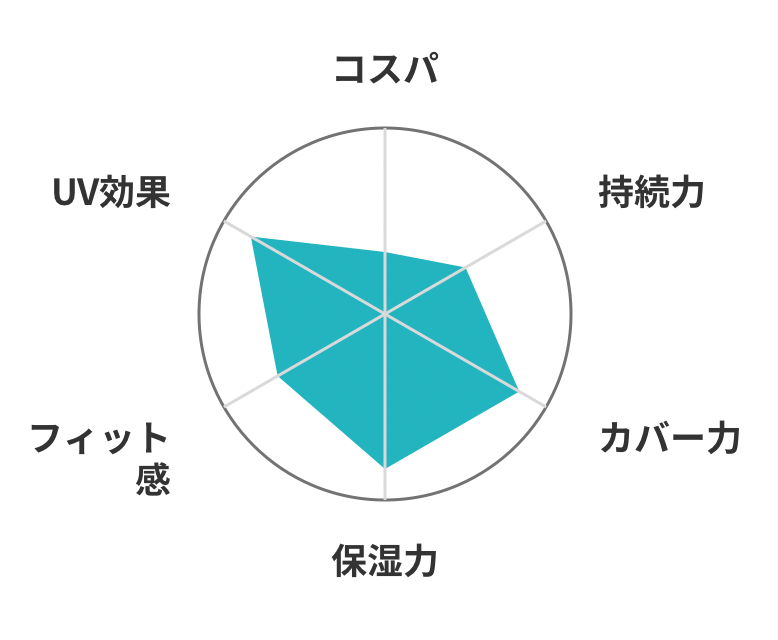

# SpiderChartView

A spider chart sample that uses [Macaw](https://github.com/exyte/macaw) library.


## Customize

You can change the style of spider chart by the following options.
```swift
// MARK: - Options
// Option: the radius of circle
private let r: Double = 62.0
// Option: the distance from the label to the circle
private let textDistance: Double = 20.0
// Option: the color of circel border
private let circleBorderColor = Color(val: 0x737373)
// Option: the color of circel border
private let circleBorderWidth: Double = 1
// Option: the color of label
private let textLabelColor = Color(val: 0x333333)
// Option: the inner line color of axis
private let innerAxisLineColor = Color(val: 0xD9D9D9)
// Option: the color of value area
private let valueAreaColor = Color(val: 0x24b4c0)
// Option: the text font of label
private let textFont = Font()
```
